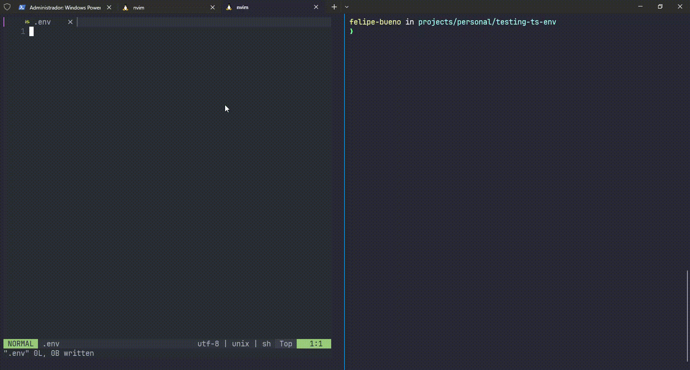

# ts-env

<p align="center">
  <a href="https://www.typescriptlang.org" target="blank"></a>
</p>

<h3 align="center">
    A simple utility package to help you with type-safe usage of process.env in Node
</h3>

## Why?

If you love Typescript and Node, you probably get frustrated to not get type-check and autocomplete when you use
`process.env` 😐. So, what about a tool that address this issue? 🚀

That's where `ts-env` comes in! You only care about your `.env` files and automatically get type-checking and autocomplete into `process.env` running this simple cli script.

## Preview



## Install

```bash
$ npm install -D @Felipe-BP/ts-env

```
## Contribution

Every contribution is welcome.

Feel free to ask anything and open any issue / PR you desire.

Just check out [Contributing](./CONTRIBUTING.md) guideline.

## License

[MIT](./LICENSE)
